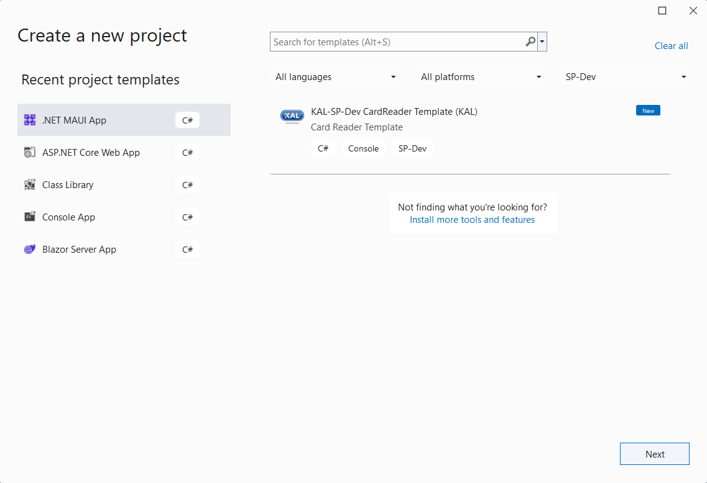

# Device Templates

The SP-Dev-Framework provides dotnet project templates which can be used as a starting point for creating an XFS4 Service Provider. These templates are supplied as a NuGet package, which once installed will allow the project templates to be available from the dotnet command line and through IDEs such as Visual Studio.

## Installing the templates

1. Install .Net 8 SDK or Visual Studio 2022.
2. Run `dotnet new --install KAL.XFS4IoT.SP-Dev.Framework.Templates` to install the SP-Dev project templates.

The templates will now be available from Visual Studio 2022 and through the .Net CLI.

## Updating installed templates

1. Run `dotnet new --update-check` to check for updates to installed template packages.
2. Use `dotnet new update` to apply updates for all listed packages.
3. Or use `dotnet new install KAL.XFS4IoT.SP-Dev.Framework.Templates::<version>` to update only the SP-Dev templates. For example `dotnet new install KAL.XFS4IoT.SP-Dev.Framework.Templates::2.1.0`

## Using the templates in Visual Studio

After installing the templates, they will now be visible in the VisualStudio "Create a new project" UI.

## Using the templates from .Net CLI.

The following command can be used to create a new CardReader project:

`dotnet new spdev-crd`

By default it will use the current directory name as the project name, and create the project files in the current directory. See [here](https://docs.microsoft.com/en-us/dotnet/core/tools/dotnet-new) for more information on using the `dotnet new` command. 

## Uninstalling the templates

1. Run `dotnet new uninstall KAL.XFS4IoT.SP-Dev.Framework.Templates` to remove the templates.